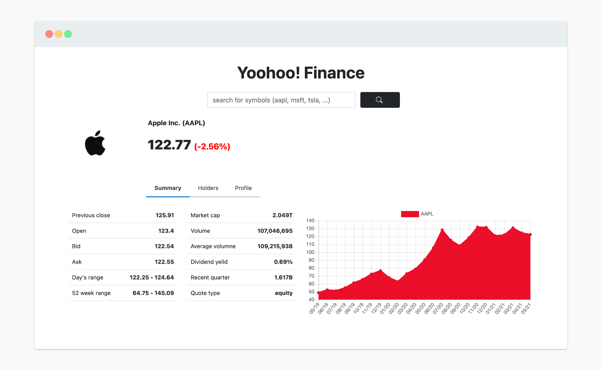
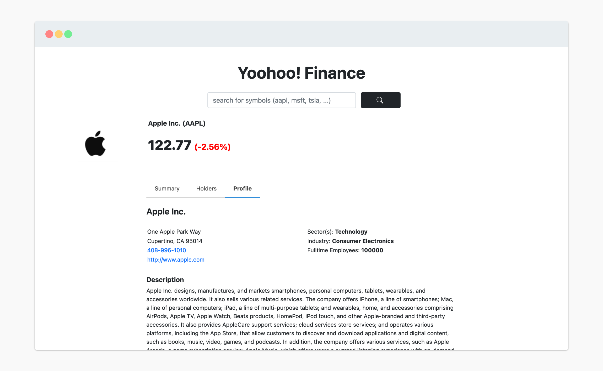

# Yoohoo! Finance - Flask

This Flask application is a Yahoo! Finance clone made using Flask, Flask-SQLAlchemy, JavaScript and data from yfinance.


## Tech Stack

**Client:** Jinja templates, Bootstrap, JavaScript

**Server:** Flask, SQLAlchemy

**Data:** yfinance module (Python)

<p align="center">
  
</p>

## Run Locally

Clone the project

```bash
  git clone https://https://github.com/SaishSankhe/Yoohoo-Finance-Flask.git
```

Go to the project directory

```bash
  cd Yoohoo-Finance-Flask
```

Install dependencies

```bash
  pip3 install -r requirements.txt
```

Start the server

```bash
  python3 app.py
```

  
